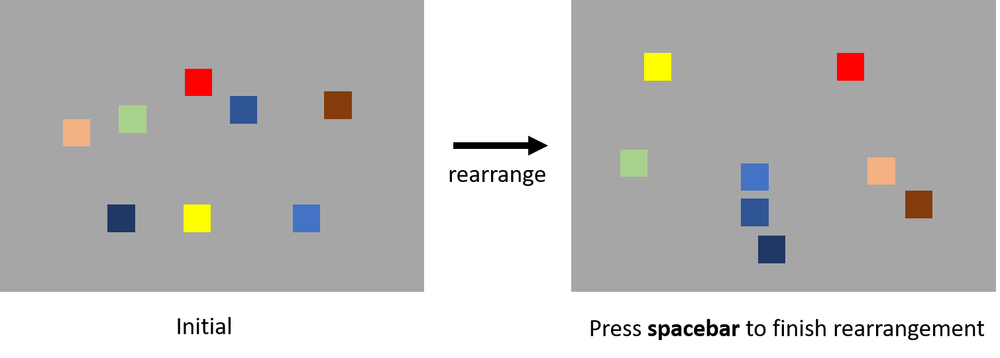

```{r setup, include=FALSE}
knitr::opts_chunk$set(echo = FALSE)
```

## Similarity Matrix

- Many cognitive models rely on similarity between items for making predictions.
- e.g.
    - SOB-CS: the recall probability is determined by the similarity between retrieved memory and response candidates.
    - IM: the activation of a response candidate is determined by the similarity between memory items and the candidate.
    - GCM: the activation of a probe is based on the similarity between probe and the examplars.

- However, measuring the similarity between items is often omitted.
    - It takes so long to acquire the similarity matrix.
    
## Similarity Matrix

- Typical task is Paired-Comparison task
    - Assuming there are $n$ items total
$$\binom{n}{2} = \frac{n(n-1)}{2}$$
    - 50 items takes
``` {r echo = TRUE}
50 * (50-1) / 2
```

- There must be a cheaper way to do this.

## Multi-Items Rearrangement Task

- Report the similarity between multiple items.
- Less trials, less time.

## Multi-Items Rearrangement Task

<center>
```{r, out.width = "800px"}

```
</center>

- The spatial distance between items represents the similarity between them.

## Multi-Items Rearrangement Task

- Advantages:
    - Faster than Paired-Comparison task.
    - Finer scale comparing to rating.
    - Less effect from diagnosticity effect.
    
- Disadvantages:
    - Potential distortion from high dimensional feature space.

## Experiment 1

Testing potential distortion.

- Materials:
<center>
```{r, out.width = "800px"}

```
</center>

- 10 participants, two sessions
- MIRT -> Paired-Comparison task.
- MIRT contains 8 items in a trial.

## Experiment 1

<center>
```{r, out.width = "800px"}

```
</center>

## Experiment 1
<center>
```{r, out.width = "500px"}

```
</center>

Paired-Comparison: red; MIRT: black

## Experiment 1

- Time to complete:
    - MIRT: 475.6s 
    - Paired-Comparison task: 905.1s
    - BF = 313.75
    
- MIRT is faster.
- The reliability and validity are good.
- There are generally no distortion problem in MIRT with the materials.

## Experiment 2

Testing continuous material

- Everything is the same as Experiment 1.
- Materials:
<center>
```{r, out.width = "300px"}

```
</center>

## Experiment 2

<center>
```{r, out.width = "800px"}

```
</center>

## Experiment 2
<center>
```{r, out.width = "500px"}

```
</center>

Paired-Comparison: red; MIRT: black

## Experiment 2

- Time to complete:
    - MIRT: 338.3s
    - Paired-Comparison task: 713.9s
    - BF = 15.7

- Both tasks can measure the similarity matrix of the items from continuous materials.
- Be aware of the gaps in the colorwheel.

## Conclusion

- MIRT is faster then Paired-Comparison task.
    - MIRT can be even faster if presenting more items at once.
<center>
```{r, out.width = "500px"}

```
</center>
- MIRT acquired similar similarity matrix as Paired-Comparison task.
- MIRT is as reliable as Paired-Comparison task.

## That's it!

<center>
  Thanks for the attention. Please ask mean questions.
</center>